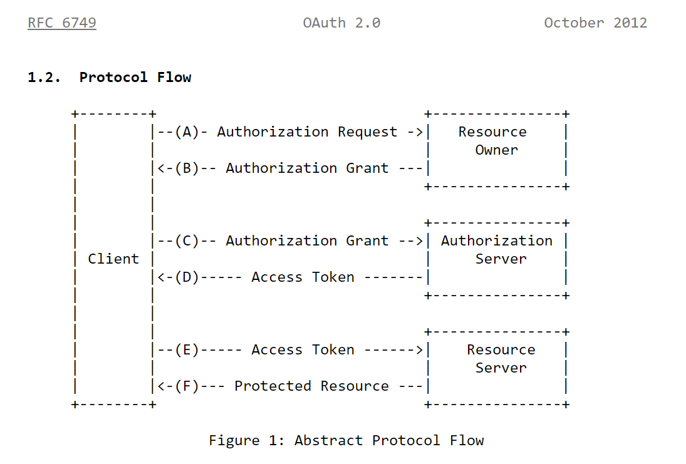

So you have created a new shiny application with a basic Email/Password authentication/authorization, and you want to add "Sign In with Github" button to it (or something similar with Google/Microsoft etc). How would you go about doing it?

I am a strong believer that in an order to become proficient with a tool, you should at least understand one abstraction level lower than what you are interacting with (for example, a C# List is implemented using a array under the hood). 

In this article, we will be dissecting OAuth2 Authorization Code flow, with Github. I will be referencing the OAuth2 source material from time to time, by *Internet Engineering Task Force* (IETF, sounds cooler when it's not abbreviated isn't it?), namely the [RFC 6749: The OAuth 2.0 Authorization Framework](https://www.rfc-editor.org/rfc/rfc6749)

## OAuth 2 Protocol Refresher

The [diagram](https://www.rfc-editor.org/rfc/rfc6749#section-1.2) above describe the high level interaction between four roles involved in the OAuth Protocol, note the following:

1. The "Client" is the entity that is requesting the authorization to access the protected resource. **No where** in the OAuth specification says that the Client **must** be a javascript code running in the browser, or the web server, it could be either, or, or something else entirely.
2. Note that OAuth specification makes a very **clear distinction** on *Resource Owner*, *Authorization Server*, and the *Resource Server*. Note that these are logical abstractions, not necessary a physical one.
3. Note that the OAuth specification makes a very **clear distinction** on the *Authorization Grant vs Access Token*.
4. **No where** in the spec did they mention *JSON Web Tokens (JWT)*, that's implementation detail.

### The Dad's Summer Car Analogy

You (the Client) want to take your dad's summer car (protected resource), which is locked in the garage (resource server), for a spin. However, the car's key is with your mum (authorization server), and she won't give it up without your dad's permission since he is the resource owner. So, you go to your dad and ask for permission (authorization request), and he grants it (authorization grant). Then, you go to your mum and somehow convince her that you have permission to use the car. She gives you the key to the garage (access token), which allows you to access the garage and retrieve the car using the key that you obtained.

## Implicit Flow

Implicit flow is a simplified authorization flow optimized for clients implemented in a browser (read: no backend). Instead of issuing the client Authorization Code, the client is issued the Access Token directly. The access token is returned directly to the client as a result of the redirect and is exposed to the client side code and could be potentially intercepted. Because of said security vulnerability, we wont be digging deeper into the implicit flow.

## Authorization Code Flow

Authorization Code Flow (or "Web Server Flow") is more secured and recommended approach for OAuth 2.0 authentication, in fact, it follows exactly what the Abstract Protocol Flow described without any simplification.

With this flow, the user is redirected to the authorization server, where they authentication, should that be successful, they are redirected back with the authorization code. The authorization code is sent back to the backend and the backend uses it to request the access token. With the access token, access to protected resource is possible.

As you can probably see, the access token exchange is done server to server and thus (with proper TLS encryption) cant be intercepted

### B...B..But what if the authorization code is intercepted?

The attacker wont be able to do much because:

1. The authorization code is generally short lived, OAuth specification recommends MAXIMUM 10 minutes lifespan.
2. The authorization code can only be used once, based on the specification, code re-use MUST result in request denial (from the Authorization Server), and if possible SHOULD revoke all Access Tokens issued by that authorization code.
3. The attacker won't have access to the `client_secret` that is stored server side, said secret is used during the access key exchange.